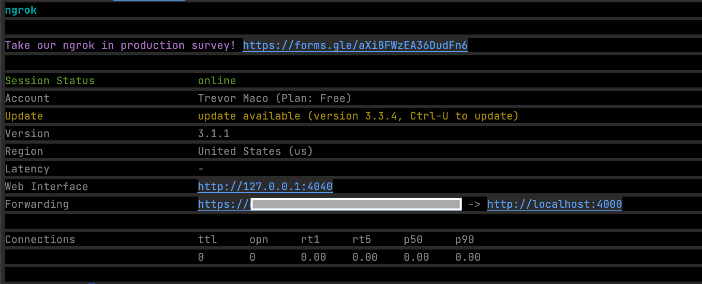

# ThousandEyes Instant Test Chatbot

The ThousandEyes Instant Test Chatbot allows a user to launch Enterprise Endpoint or Enterprise Agent Instant Tests for **Select Applications** or a **Custom URL** through a Webex Bot. This allows a user to independently launch tests and proactively gather data before reporting problems to a help desk.

The bot has the following **options** (and their **tests**) pre-encoded:

* Office 365 (**http-server**)
* Webex Audio (**http-server** & **agent-to-server**)
* Webex Video (**http-server** & **agent-to-server**)
* Cisco SalesForce (**http-server**)
* Custom URL (**http-server**)

**Note**: All URLs are accurate at the time of publishing, but may change over time. URLs can be updated at the top of the `test_creation.py` file and are mapped to the help card options in the `test_selector()` method.

## Contacts
* Trevor Maco
* Josh Ingeniero
* Hemang Shah
* Yi Ren

## Solution Components
* ThousandEyes
* Webex Bot
* Python 3.11
* Flask

## Prerequisites

### ThousandEyes

This Webex Bot assumes a ThousandEyes deployment exists with at least one Endpoint Agent and/or one Enterprise Agent.

To use the ThousandEyes APIs, a  `Bearer Token` is required for a user with the `API access` permissions. To generate a Bearer Token, go to `Account Settings > Users and Roles > User API Tokens` and generate a OAuth Bearer Token. Note this token.


### Webex Bot
To create a Webex Bot, follow this workflow:
1. Log in to `developer.webex.com`
2. Click on your avatar and select `My Webex Apps`
3. Click `Create a New App`
4. Click `Create a Bot` to start the wizard
5. Following the instructions of the wizard, provide your bot's name, username, and icon
6. Once the form is filled out, click `Add Bot` and you will be given an access token
7. Copy the access token and store it safely. Please note that the API key will be shown only once for security purposes. In case you lose the key, then you have to revoke the key and generate a new key.

Additional Webex Bot documentation can be found [here](https://developer.webex.com/docs/bots).

### Webhooks
The app needs to be reachable on `port 4000` from the public internet for Webex Webhooks to be received and processed. Any option is valid like AWS Lambda, Heroku, GCP, etc. `Ngrok` is used here to expose the local app for simplicity.

#### ngrok
The flask app runs on http://localhost:4000 by default, so it requires a Ngrok forwarding address to `port 4000` to recieve the webhooks.

Follow these instructions to set up ngrok:
1. Create a free account or login to [Ngrok](https://ngrok.com/).
2. Retrieve your auth token by navigating to `Getting Started` > `Your Authtoken` on the menu on the left-hand side. Copy the token on this page.
3. Then install the client library depending on your OS [here](https://ngrok.com/download).
4. Once you have ngrok installed, update the ngrok configuration file with your auth token by running the following command on the terminal/command prompt: 
```
ngrok authtoken [yourtoken]
```
replacing [yourtoken] with the authtoken you copied in Step 2.

5. Start the ngrok tunnel for port 4000 with the command:
```
ngrok http 4000
```


## Installation/Configuration
1. Clone this repository with `git clone [repository name]`
2. Add the Webex Bot Token and Webex Bot Email to `config.py`:
```python
# Webex Bot
BOT_TOKEN = ""
BOT_EMAIL = ""
```
3. Add the publicly facing app url to `config.py` (ex: Ngrok forwarding address)
```python
WEBHOOK_BASE_URL = ""
```
4. Add the ThousandEyes bearer token to `config.py`
```python
# ThousandEyes
THOUSAND_EYES_TOKEN = ""
```
5. Set up a Python virtual environment. Make sure Python 3 is installed in your environment, and if not, you may download Python [here](https://www.python.org/downloads/). Once Python 3 is installed in your environment, you can activate the virtual environment with the instructions found [here](https://docs.python.org/3/tutorial/venv.html).
6. Install the requirements with `pip3 install -r requirements.txt`


## Usage

1. Launch the bot with the command:
``` bash
python3 app.py
```

To use the bot, start a conversation by adding the bot to a 1-1 or Group space.

Send the command `network-help` to display the primary card for launching tests:


This card requires 2 things:
* A ThousandEyes Agent (Enterprise or Endpoint)

To use an Enterprise Agent, enter the `Agent Name` as seen on the ThousandEyes Dashboard:


To use an Endpoint Agent, enter the `Agent Hostname` as seen on the ThousandEyes Dashboard:


* A Target Application (pre-built or custom url)

After clicking `submit`, the proper test will run, and after some time the results will be returned to the Webex space in the form of cards. 2 types of results exist: `Success`, and `Failure`.
* `Success`: A 2XX HTTP Response code from the target url
* `Failure`: A Non 2XX HTTP Response code from the target url

The code can easily be updated and amended to consider metrics during state determination as well, like: loss, latency, etc. Refer to `generate_result.py` > `generate_result()` to modify the determination code.

Example test results are shown below:

* Enterprise Agent Success:


* Endpoint Agent Success:


* Failure:


# Screenshots


### LICENSE

Provided under Cisco Sample Code License, for details see [LICENSE](LICENSE.md)

### CODE_OF_CONDUCT

Our code of conduct is available [here](CODE_OF_CONDUCT.md)

### CONTRIBUTING

See our contributing guidelines [here](CONTRIBUTING.md)

#### DISCLAIMER:
<b>Please note:</b> This script is meant for demo purposes only. All tools/ scripts in this repo are released for use "AS IS" without any warranties of any kind, including, but not limited to their installation, use, or performance. Any use of these scripts and tools is at your own risk. There is no guarantee that they have been through thorough testing in a comparable environment and we are not responsible for any damage or data loss incurred with their use.
You are responsible for reviewing and testing any scripts you run thoroughly before use in any non-testing environment.